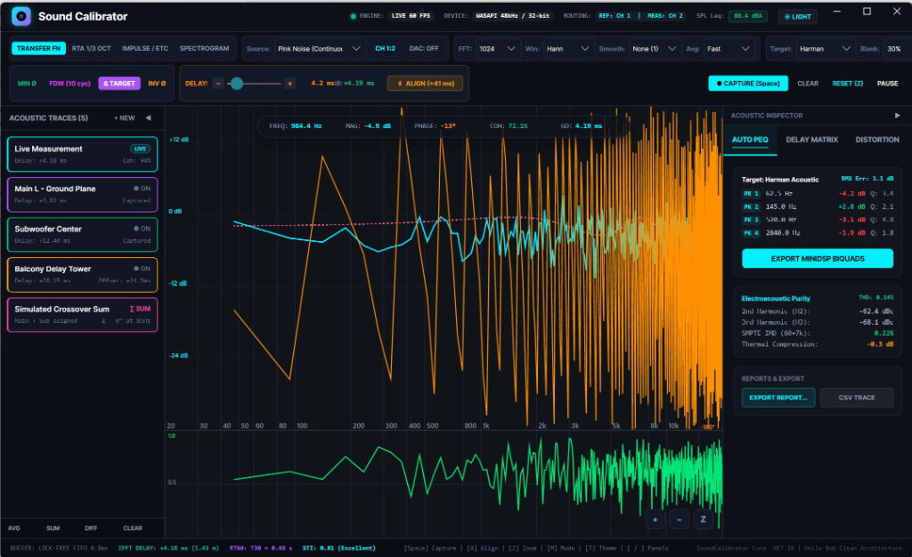
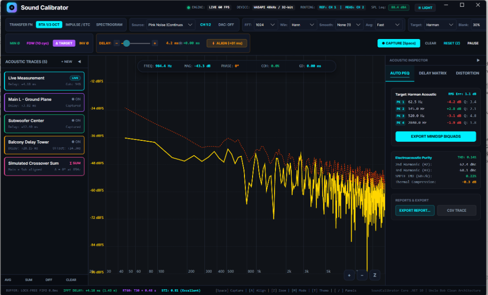
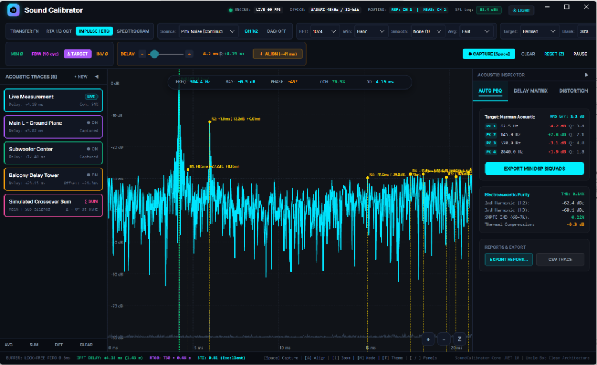
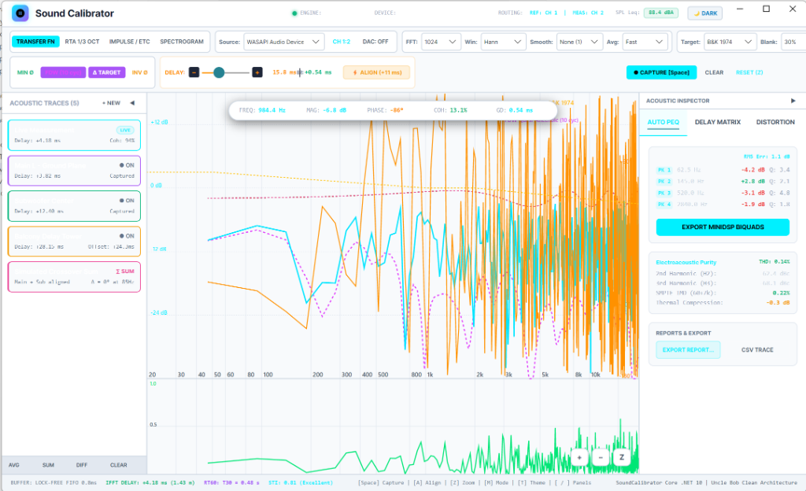
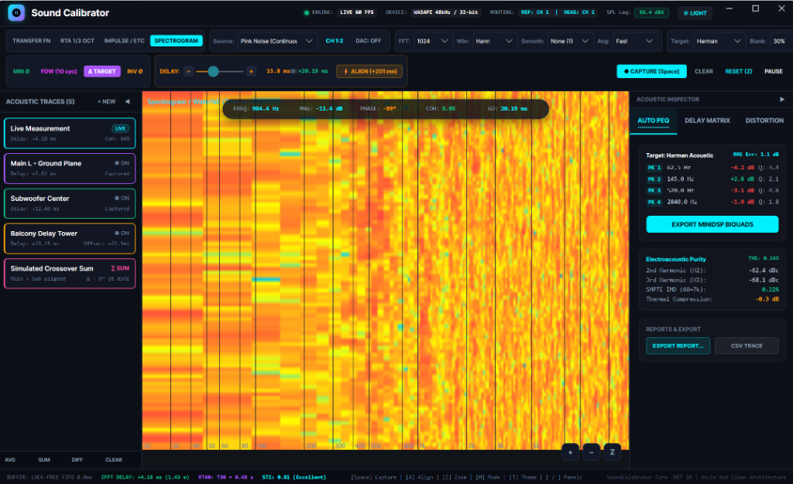

# Sound Calibrator 🎛️⚡

> **Software profesional de calibración acústica y medición en tiempo real de doble canal (Dual-Channel FFT Transfer Function Analyzer).**  
> Inspirado en la arquitectura y capacidades de **Open Sound Meter**, **Smaart v9** y **REW**, desarrollado íntegramente bajo la disciplina de **SwarmForge** (Uncle Bob Clean Architecture & Software Craftsmanship) sobre **.NET 10**, **Avalonia UI** y **SkiaSharp**.

---

## 📸 Interfaz de Usuario y Capturas de Pantalla

| Vista | Descripción y Características |
| :--- | :--- |
|  | **Función de Transferencia Dual-Channel (Modo Oscuro):**<br>Medición FFT de doble canal en tiempo real con motor gráfico SkiaSharp a 60 FPS. Muestra simultáneamente la magnitud acústica ($+18\text{ dB}$ a $-36\text{ dB}$), fase continua y coherencia ($\gamma^2$) con blanking configurable, trazado de curva objetivo Harman Target, panel gestor de trazas acústicas múltiples con controles de visibilidad y ecualizador paramétrico automático (Auto PEQ). |
|  | **Analizador de Espectro en Tiempo Real (RTA 1/3 de Octava):**<br>Análisis de energía acústica fraccional bajo estándar internacional ISO 266, función Max-Hold histórica, barra inferior de telemetría acústica y sonómetro integrador en decibelios ($L_{\text{eq}}$ ponderación A/C/Z con calibración acústica). |
|  | **Respuesta al Impulso (IR) y Cazador de Reflexiones Tempranas (ETC):**<br>Síntesis por IFFT con detección automática del tiempo de vuelo ($t_0$) y detección algorítmica de reflexiones de sala etiquetadas en tiempo real (R1 a R4) indicando retardo en milisegundos, nivel relativo en dB y diferencia física de recorrido en metros ($\Delta d$). |
|  | **Modo Claro de Alta Visibilidad (Light Theme):**<br>Esquema de color dinámico de alto contraste conmutado al instante mediante la barra superior. Diseñado especialmente para calibraciones y ajustes acústicos en exteriores bajo radiación solar directa o en recintos fuertemente iluminados. |
|  | **Espectrograma 2D en Cascada (Waterfall Heatmap):**<br>Mapa de densidad espectral continua a 60 FPS acelerado por GPU que ilustra la disipación temporal de energía y facilita la identificación inmediata de resonancias de sala, modos propios y acoples acústicos. |

---

## 🌟 Capacidades y Módulos del Sistema

### 🔬 Motor Matemático DSP (Clean Architecture / Cero Alocaciones en Hot Loop)
* **Función de Transferencia Dual-Channel (H1 Estimator):**
  * **Magnitud en dB:** $20 \log_{10}(|H(f)|)$ con escala configurable de $+18\text{ dB}$ a $-36\text{ dB}$.
  * **Fase en grados:** $\text{atan2}$ con rango de $+180^\circ$ a $-180^\circ$.
  * **Desenrollado de Fase (Phase Unwrap):** Eliminación continua de discontinuidades de $360^\circ$ para análisis acústico de pendientes de retardo.
  * **Coherencia ($\gamma^2$):** Medición de causalidad y relación señal/ruido $[0.0, 1.0]$.
  * **Coherence Blanking:** Supresión configurable de trazado de fase en zonas de baja coherencia ($30\%, 50\%, 70\%$).
* **FFT Radix-2 & IFFT ($O(N \log N)$):** Transformadas directa e inversa con tablas precomputadas de factores twiddle y reversión de bits.
* **Ventaneado Temporal:** Hann, Blackman-Harris de 4 términos optimizados sobre `Span<float>`.
* **Cero Asignaciones en el Heap (0 Bytes GC Allocation):** Procesamiento de audio continuo en worker thread sin pausas de Garbage Collector.

### ⏱️ Respuesta al Impulso, ETC y Acústica de Salas
* **Respuesta al Impulso ($h(t)$):** Síntesis vía IFFT con resolución submilisegundo.
* **Auto-Delay Tracker:** Detección automática del tiempo de vuelo directo ($t_0$) y compensación con botón `ALIGN (A)`.
* **Energy-Time Curve (ETC):** Envolvente logarítmica analítica calculada mediante **Transformada de Hilbert** ($z(t) = h(t) + j\mathcal{H}\{h(t)\}$).
* **Cazador de Reflexiones Tempranas (Early Reflections Hunter):** Supresión de no-máximos que detecta y etiqueta reflexiones acústicas (tiempo relativo $\text{ms}$, nivel $\text{dB}$, diferencia de camino físico $\Delta d$ en metros).
* **Tiempo de Reverberación RT60 (ISO 3382):** Cálculo de $T_{20}$, $T_{30}$ y EDT mediante integración reversa de Schroeder.
* **Índice de Inteligibilidad de la Palabra STI (IEC 60268-16):** Matriz MTF modulada (14 frecuencias) con calificación cualitativa (Bad a Excellent).
* **Frequency-Dependent Windowing (FDW):** Ventaneado adaptativo por ciclos (5-15 períodos) centrado en el arribo directo para mediciones cuasi-anecoicas libres de reflexiones de sala.

### 🧠 Fase Mínima, Retardo de Grupo y Procesamiento de Señal
* **Analizador de Fase Mínima (Minimum Phase Synthesis):** Reconstrucción mediante cepstrum real con filtrado lifter causal, aislamiento de **Fase en Exceso** ($\phi_{\text{excess}}$) y **Retardo de Grupo en Exceso** ($\tau_{\text{excess}}$).
* **Retardo de Grupo (Group Delay):** $\tau_g(f) = -\frac{1}{360}\frac{d\phi}{df}$ para localización de desalineaciones temporales entre vías acústicas.
* **Detector de Feedback en Vivo (Feedback Hunter):** Detección instantánea de frecuencias de acople con umbrales de prominencia y ancho de banda Q.

### 📈 RTA, Espectrograma y Análisis de Distorsión
* **RTA en Tiempo Real:** Curva continua y modo barras por tercios de octava según estándar **ISO 266** con Max-Hold histórico y Reset.
* **Espectrograma 2D Cascada:** Visualización temporal de densidad espectral a 60 FPS acelerada por GPU.
* **Distorsión Armónica Total (THD):** Análisis de armónicos H2 a H10 y THD+N en porcentaje y dBc.
* **Distorsión por Intermodulación (IMD):**
  * Estándar **SMPTE RP120** ($60\text{ Hz} + 7\text{ kHz}$, relación 4:1).
  * Estándar **CCIF / ITU-R DFD** ($19\text{ kHz} + 20\text{ kHz}$, relación 1:1) con interpolación parabólica de picos.
* **Compresión Térmica y de Potencia:** Monitoreo electroacústico de pérdida de sensibilidad dinámica ($\text{Loss}(f)$) frente a señales de alta excitación.
* **Sonómetro Integrador (SPL Meter):** Ponderación de frecuencia A, C y Z (Flat), cálculo de $L_{\text{eq}}$ y calibración acústica con pistófono de $94\text{ dB}$.

### 📐 Alineación de Sistemas & Simulación Acústica
* **Asistente de Alineación de Crossover (Subwoofer + Top):** Cálculo analítico de desfase y retardo óptimo en la frecuencia de corte.
* **Matriz de Retardos Multi-Zona:** Algoritmo para sincronizar PA principal con front-fills, out-fills y torres de delay compensando temperatura ambiente.
* **Simulador de Suma Acústica Compleja:** Suma vectorial fasorial ($\vec{A} + \vec{B}$) modelando interferencia constructiva, destructiva y filtrado peine en tiempo real.
* **Matemática de Trazas Diferenciales:** Operación espectral $H_A / H_B$ para comparar transferencias y evaluar cambios acústicos.
* **Promediado Espacial:** Modos Power Average y Complex Spatial Average con ponderación individual.
* **Curvas Objetivo (Target Curves):** Presets Harman, Brüel & Kjær 1974, Cinema X-Curve y curva de error $\Delta\text{ Delta}$ interactiva.
* **Ecualización Paramétrica Automática (Auto PEQ):** Algoritmo de síntesis de filtros paramétricos IIR de 2º orden (Biquad), previsualización en vivo y exportación a **miniDSP** y procesadores genéricos (CSV).

### 🎛️ Generador Sintético & Hardware I/O
* **Generador Acústico Multitono:** Ruido rosa (filtro Paul Kellet $-3\text{ dB/oct}$), senoidal $1\text{ kHz}$, barrido Farina ($20\text{ Hz}-20\text{ kHz}$), ruido rosa con compuerta (gated pink), ruido IEC 60268-1, pulsos Dirac de polaridad, tonos SMPTE y tonos CCIF.
* **Salida de Audio Física (DAC Streaming):** Streaming de baja latencia vía NAudio WASAPI Render con control maestro de volumen, mute y botón `DAC OUT: ON/OFF`.
* **Enrutamiento Multi-Canal WASAPI:** Selección de canales de hardware y conmutador en caliente de canal de Referencia y Medición (`CH 1:2 / 2:1`).
* **Gestión de Proyectos & Reportes:**
  * Guardado y apertura completa de sesiones de calibración (`.scproj` JSON).
  * Exportación e importación de trazas en formato CSV compatible con Smaart y REW.
  * Generador de Informes Técnicos de Calibración en formato Markdown y HTML standalone listo para imprimir.
* **Control Gráfico Interactivo:** Zoom y paneo logarítmico en frecuencia y dB mediante rueda del ratón, arrastre con botón derecho y atajo `RESET (Z)`.

---

## 🏗️ Arquitectura de la Solución

```text
SoundCalibrator/
├── src/
│   ├── SoundCalibrator.Core/         --> [Dominio Matemático DSP Puro - 0 Heap Allocations]
│   │   ├── Analysis/                 (MinimumPhase, PowerCompression, ImdCalculator, TraceMath, etc.)
│   │   ├── Averaging/                (Promediado espectral: Fast, Slow, Lin16, Infinito)
│   │   ├── Calibration/              (Curvas de micrófono .cal con interpolación logarítmica)
│   │   ├── DSP/                      (FFT, IFFT, Windowing, TransferFunction, IR, ETC, FDW, Biquad)
│   │   ├── Models/                   (AcousticTrace, ProjectSession, PeqFilterSuggestion, etc.)
│   │   ├── Reports/                  (ReportGenerator en Markdown y HTML standalone)
│   │   ├── Serialization/            (SessionSerializer JSON y TraceSerializer CSV)
│   │   └── Smoothing/                (Suavizado fraccionario de octava 1/1 a 1/48)
│   │
│   ├── SoundCalibrator.Audio/        --> [Adaptador de Hardware de Audio I/O]
│   │   ├── Buffers/                  (AudioFifoBuffer circular lock-free multihilo)
│   │   ├── Devices/                  (WasapiAudioCaptureDevice y WasapiAudioOutputDevice)
│   │   ├── Engine/                   (AcousticMeasurementEngine con worker thread DSP)
│   │   └── Generators/               (SyntheticAudioGenerator: Pink, Sine, Sweep, IEC, SMPTE, CCIF)
│   │
│   └── SoundCalibrator.App/          --> [Presentación: Avalonia UI + SkiaSharp]
│       ├── Controls/                 (AcousticGraphControl: Dibujo GPU 60 FPS con Zoom & Pan)
│       └── MainWindow.axaml          (UI oscura profesional, toolbar, atajos y modales)
│
└── tests/
    └── SoundCalibrator.Core.Tests/   --> [103 Pruebas Unitarias TDD xUnit]
```

---

## 🚀 Ejecución y Verificación

### Compilar y Ejecutar Pruebas Automatizadas:
```powershell
dotnet test
```
* **103 pruebas unitarias automatizadas pasando al 100% en ~200 ms.**
* Cero advertencias (`0 Warning(s)`) y cero errores (`0 Error(s)`).

### Lanzar la Aplicación:
```powershell
dotnet run --project src/SoundCalibrator.App/SoundCalibrator.App.csproj
```

---

## 📜 Licencia & Constitución
Desarrollado bajo las normas éticas y de calidad de software de la **Constitución de Ingeniería SoundCalibrator** inspirada en el framework multi-agente **SwarmForge** de Robert C. Martin (*Uncle Bob*).
